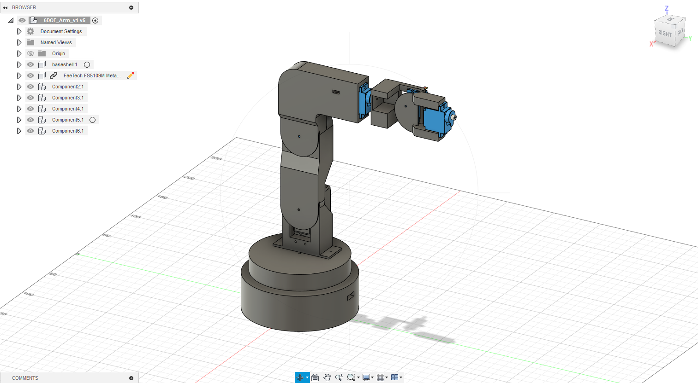
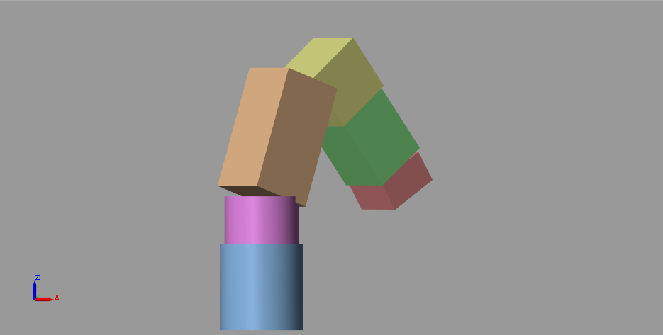
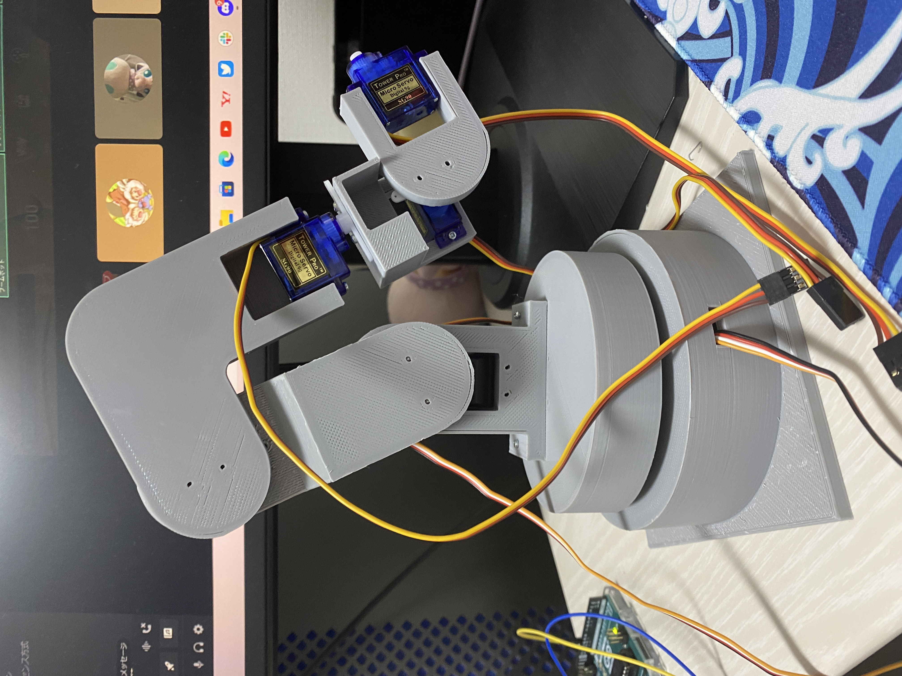
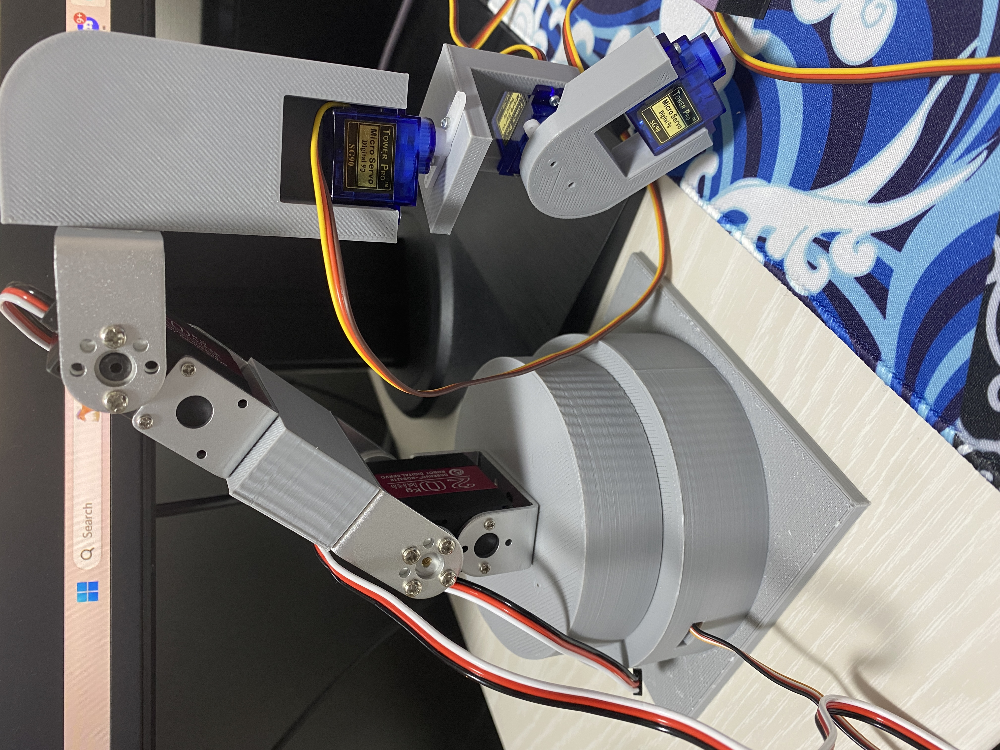

# Robot-Arm-Kinematics-Simulations
Creating a robot arm from scratch. Matlab and C++ implementations for robot arm kinematic computations.

<b>What the repository contains:</b>
- C++ code for inverse and forward kinematic calculations
  - C++ code for utlity functions (matrix operations and euler-rotation conversions)
- Matlab simulink model for inverse and forward kinematic simulations
- 3D CAD models of the robot arm for 3D printing

## 6DOF Spherical Wrist Kinematic Analysis

### Forward Kinematics

A homogeneous transformation matrix describes both orientation and position of a frame.

let $\vec{d}$ be the displacement vector:

$$\vec{d} = \begin{bmatrix}
x\\
y\\
z\end{bmatrix}$$

and $rot(X,Y,Z)$ be the rotation matrix.

The homogeneous transformation matrix can be expressed in the following structure:

$$H = \begin{bmatrix}
rot(X,Y,Z) & \vec{d} \\
\vec{0}^T & 1 \end{bmatrix}$$

let $H_{nm}$ be the homogeneous transformation matrix from frame n to m, then the homogeneous transformation from base frame to the end effector is found simply with a chain of matrix multiplication of $H_{n,n+1}$:

$$H_{06} = H_{01} * H_{12} * H_{23} * H_{34} * H_{45} * H_{56}$$

### Inverse Kinematics

## Robot Arm Progress

### 2023.10.21
3D CAD Model:

Matlab Simulink:

### 2023.10.26

First 3D Printed Prototype:

Points of improvement:
- not enough torque for joint 3
- some links contact when rotated

### 2023.10.29

First update:

- Replaced joints 1 and 2 with new servos (RDS3218)
- fixed some links

Points of improvement:
- servo wiring
- lack of stability for joints 4, 5, 6 (SG90)

